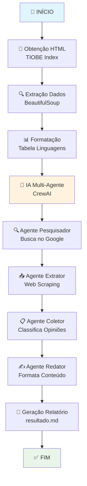

# Sistema de Extração Automática de Dados - Linguagens de Programação

Um sistema inteligente que coleta dados sobre as linguagens de programação mais populares do TIOBE Index e utiliza IA multi-agente para gerar análises abrangentes baseadas em opiniões da comunidade.

## 📋 Descrição do Projeto

Este projeto implementa um pipeline automatizado que:

1. **Coleta dados** do TIOBE Index sobre as linguagens de programação mais populares
2. **Extrai informações** estruturadas usando web scraping 
3. **Utiliza IA multi-agente** (CrewAI) para coletar opiniões da comunidade
4. **Gera relatórios** formatados em Markdown com análises detalhadas

O sistema emprega quatro agentes de IA especializados que trabalham sequencialmente:
- **Pesquisador**: Busca opiniões no Google sobre cada linguagem
- **Extrator**: Navega URLs e extrai conteúdo relevante
- **Coletor**: Classifica opiniões em positivas e negativas
- **Redator**: Organiza e formata o conteúdo final

## 🚀 Instruções de Execução

### Pré-requisitos

- Python 3.8+
- Chaves de API válidas:
  - OpenAI API Key
  - Google Gemini API Key  
  - Serper API Key (para buscas no Google)

### Instalação

1. **Clone o repositório**
```bash
git clone <repository-url>
cd scrap
```

2. **Instale as dependências**
```bash
pip install -r requirements.txt
```

3. **Configure as variáveis de ambiente**
```bash
# Copie o arquivo de exemplo
cp .env.example .env

# Edite o arquivo .env com suas chaves de API
SERPER_API_KEY=sua_chave_serper
OPENAI_API_KEY=sua_chave_openai
GOOGLE_API_KEY=sua_chave_google
```

### Execução

```bash
python main.py
```

### Arquivos de Saída

O sistema gera os seguintes arquivos:

- **`response.html`**: Cache do HTML do TIOBE Index
- **`resultado.md`**: Relatório final com tabelas e análises
- **`crewlog.txt`**: Log detalhado da execução dos agentes IA

## 🔄 Diagrama do Pipeline



## 📦 Dependências

### Principais Bibliotecas

- **requests**: Requisições HTTP para o TIOBE Index
- **beautifulsoup4**: Parsing e extração de dados HTML
- **python-dotenv**: Gerenciamento de variáveis de ambiente
- **crewai**: Framework de IA multi-agente
- **crewai-tools**: Ferramentas especializadas (Google Search, Web Scraping)

### APIs de IA

- **OpenAI**: Processamento de linguagem natural
- **Google Gemini**: Análise e geração de conteúdo
- **Serper**: API de busca do Google

### Arquivo completo de dependências

```
requests
beautifulsoup4
python-dotenv
openai
google-generativeai
crewai
crewai-tools
```

## 🏗️ Arquitetura do Sistema

### Estrutura de Diretórios

```
scrap/
├── main.py                    # Ponto de entrada principal
├── ObtencaoHtml.py           # Coleta de dados do TIOBE Index
├── ObtencaoLinguagem.py      # Extração de dados das linguagens
├── Work.py                   # Processamento e formatação
├── ColetagemOpiniaoUsuario.py # Interface para sistema de IA
├── Equipe.py                 # Orquestração dos agentes CrewAI
├── Comum/
│   ├── LLM/                  # Configuração de modelos de IA
│   ├── Models/               # Modelos de dados
│   └── Utils/                # Utilitários e ferramentas
├── requirements.txt          # Dependências do projeto
└── README.md                # Documentação
```

### Componentes Principais

1. **Camada de Dados**: Obtenção e cache de dados do TIOBE Index
2. **Camada de Processamento**: Extração e formatação de informações
3. **Camada de IA**: Sistema multi-agente para análise de opiniões
4. **Camada de Saída**: Geração de relatórios estruturados

## 🛠️ Características Técnicas

- **Cache Inteligente**: Evita requisições desnecessárias
- **Processamento Assíncrono**: Agentes IA trabalham sequencialmente
- **Modularidade**: Arquitetura limpa e extensível
- **Logging Detalhado**: Rastreamento completo da execução
- **Saída Estruturada**: Relatórios em formato Markdown

## 📊 Dados Coletados

Para cada linguagem de programação, o sistema coleta:

- **Nome da linguagem**
- **Percentual de participação** no índice TIOBE
- **Taxa de crescimento** mensal
- **Opiniões positivas** da comunidade
- **Opiniões negativas** da comunidade
- **Análise consolidada** baseada em múltiplas fontes

## 🔧 Configuração Avançada

### Personalização do Número de Linguagens

No arquivo `main.py`, você pode ajustar a variável `quantidade` para processar mais ou menos linguagens:

```python
quantidade = 2  # Processa as 2 linguagens mais populares
```

### Configuração de Verbosidade

Para logs mais detalhados durante a execução:

```python
work_linguagem = WorkLinguagem(verbose=True)
```

## 🤝 Contribuição

Contribuições são bem-vindas! Por favor:

1. Faça fork do projeto
2. Crie uma branch para sua feature (`git checkout -b feature/AmazingFeature`)
3. Commit suas mudanças (`git commit -m 'Add some AmazingFeature'`)
4. Push para a branch (`git push origin feature/AmazingFeature`)
5. Abra um Pull Request

## 📄 Licença

Este projeto está licenciado sob a licença MIT - veja o arquivo [LICENSE](LICENSE) para detalhes.

## 🙏 Agradecimentos e Fontes

- **[TIOBE Index](https://www.tiobe.com/tiobe-index/)**: Fonte dos dados sobre popularidade das linguagens de programação
- **[CrewAI](https://github.com/crewAIInc/crewAI)**: Framework de IA multi-agente utilizado no projeto
- **[OpenAI](https://openai.com/)**: Modelos de linguagem para processamento de texto
- **[Google Gemini](https://deepmind.google/technologies/gemini/)**: IA generativa para análise de conteúdo
- **[Serper](https://serper.dev/)**: API de busca do Google
- **[BeautifulSoup](https://www.crummy.com/software/BeautifulSoup/)**: Biblioteca para parsing HTML

### Menção Especial

Este projeto foi desenvolvido como parte de estudos em **Extração Automática de Dados** e **Sistemas de IA Multi-Agente**, demonstrando a integração de técnicas de web scraping com inteligência artificial avançada.

---

**Desenvolvido com ❤️ para a comunidade de desenvolvedores** 

