# Fluxogramas do Sistema de Extração Automática de Dados

Este documento apresenta os fluxogramas que ilustram o funcionamento do sistema de extração automática de dados sobre linguagens de programação.

## 🔄 Fluxograma Principal - Fluxo de Execução

```mermaid
flowchart TD
    A["🚀 INÍCIO<br/>main.py"] --> B["📄 ObtencaoHtml<br/>Verifica se existe arquivo HTML local"]
    
    B --> C{Arquivo HTML<br/>existe?}
    C -->|Sim| D["📂 Carrega HTML<br/>do arquivo local"]
    C -->|Não| E["🌐 Faz requisição HTTP<br/>para TIOBE Index"]
    
    D --> F["🔍 ObtencaoLinguagem<br/>Analisa HTML com BeautifulSoup"]
    E --> G["💾 Salva HTML<br/>em arquivo local"]
    G --> F
    
    F --> H["📊 Extrai dados da tabela<br/>top20 (nome, rating, change)"]
    H --> I["📋 Cria lista de linguagens<br/>com suas informações"]
    
    I --> J["📝 WorkFile<br/>Limpa arquivo resultado"]
    J --> K["📄 Adiciona título<br/>'LINGUAGENS MAIS USADAS'"]
    K --> L["📊 WorkLinguagem<br/>Gera tabela formatada"]
    L --> M["💾 Salva tabela no arquivo"]
    
    M --> N["🔄 Loop: Para cada linguagem<br/>(quantidade = 2)"]
    N --> O["💬 ColetagemOpiniaoUsuario<br/>Coleta opiniões sobre linguagem"]
    
    O --> P["👥 Equipe (CrewAI)<br/>Sistema de IA com múltiplos agentes"]
    
    P --> Q["🔍 Agente Pesquisador<br/>Busca opiniões no Google"]
    Q --> R["📥 Agente Extrator<br/>Navega URLs e extrai conteúdo"]
    R --> S["📋 Agente Coletor<br/>Encontra opiniões positivas/negativas"]
    S --> T["✍️ Agente Redator<br/>Organiza em listas formatadas"]
    
    T --> U["📄 Adiciona comentários<br/>ao arquivo resultado"]
    U --> V{Próxima<br/>linguagem?}
    V -->|Sim| N
    V -->|Não| W["✅ FIM<br/>Arquivo resultado.md gerado"]
    
    style A fill:#e1f5fe
    style W fill:#e8f5e8
    style P fill:#fff3e0
    style Q fill:#fce4ec
    style R fill:#fce4ec
    style S fill:#fce4ec
    style T fill:#fce4ec
```



### Explicação do Fluxo Principal

1. **Inicialização (main.py)**
   - O sistema inicia a execução
   - Importa todas as classes necessárias

2. **Obtenção do HTML**
   - Verifica se existe um arquivo HTML local (`response.html`)
   - Se existir, carrega do arquivo (cache)
   - Se não existir, faz requisição HTTP para o TIOBE Index

3. **Extração de Dados**
   - Utiliza BeautifulSoup para parsing do HTML
   - Localiza a tabela com ID `top20`
   - Extrai nome, rating e mudança de cada linguagem

4. **Processamento Inicial**
   - Limpa o arquivo de resultado
   - Adiciona título da seção
   - Gera tabela formatada das linguagens

5. **Loop de Processamento por Linguagem**
   - Para cada linguagem (configurado para 2)
   - Inicia processo de coleta de opiniões

6. **Sistema de IA Multi-Agente**
   - Executa sequência de 4 agentes especializados
   - Cada agente tem uma função específica no processo

## 🏗️ Arquitetura do Sistema - Componentes e Responsabilidades

```mermaid
graph TB
    subgraph "🏗️ ARQUITETURA DO SISTEMA"
        subgraph "📊 Camada de Dados"
            HTML["📄 HTML<br/>(TIOBE Index)"]
            JSON["📋 Dados Estruturados<br/>(linguagens)"]
            MD["📝 Arquivo Final<br/>(resultado.md)"]
        end
        
        subgraph "🔧 Camada de Processamento"
            ObtHTML["🌐 ObtencaoHtml<br/>• Faz requisição HTTP<br/>• Cache local<br/>• Headers customizados"]
            ObtLang["🔍 ObtencaoLinguagem<br/>• Parse HTML com BeautifulSoup<br/>• Extrai tabela top20<br/>• Estrutura dados"]
            WorkLang["📊 WorkLinguagem<br/>• Formatação de tabelas<br/>• Geração de comentários<br/>• Interface com IA"]
            WorkFile["💾 WorkFile<br/>• Gerenciamento de arquivo<br/>• Append/Clear operações<br/>• Encoding UTF-8"]
        end
        
        subgraph "🤖 Camada de IA (CrewAI)"
            Coleta["💬 ColetagemOpiniaoUsuario<br/>• Orquestra processo IA<br/>• Interface simplificada"]
            Equipe["👥 Equipe<br/>• Sistema multi-agente<br/>• Processo sequencial"]
            
            subgraph "🧠 Agentes IA"
                Pesq["🔍 Pesquisador<br/>• Google Search<br/>• Busca opiniões"]
                Extr["📥 Extrator<br/>• Web Scraping<br/>• Limpeza conteúdo"]
                Cole["📋 Coletor<br/>• Análise conteúdo<br/>• Classificação"]
                Reda["✍️ Redator<br/>• Formatação final<br/>• Organização"]
            end
        end
        
        subgraph "🛠️ Utilitários"
            Utils["🔧 FileTool<br/>• Save/Load arquivos<br/>• Encoding UTF-8"]
            JSON_Tool["📊 JSONTool<br/>• Parse JSON<br/>• Extração campos"]
        end
    end
    
    HTML --> ObtHTML
    ObtHTML --> ObtLang
    ObtLang --> JSON
    JSON --> WorkLang
    WorkLang --> Coleta
    Coleta --> Equipe
    
    Equipe --> Pesq
    Pesq --> Extr
    Extr --> Cole
    Cole --> Reda
    
    Reda --> WorkFile
    WorkFile --> Utils
    Utils --> MD
    
    style HTML fill:#e3f2fd
    style JSON fill:#e8f5e8
    style MD fill:#fff3e0
    style Equipe fill:#fce4ec
    style Pesq fill:#f3e5f5
    style Extr fill:#f3e5f5
    style Cole fill:#f3e5f5
    style Reda fill:#f3e5f5
```



### Explicação da Arquitetura

#### 📊 Camada de Dados
- **HTML**: Dados brutos do TIOBE Index
- **Dados Estruturados**: Informações extraídas e organizadas
- **Arquivo Final**: Relatório em Markdown gerado

#### 🔧 Camada de Processamento
- **ObtencaoHtml**: Responsável pela obtenção e cache do HTML
- **ObtencaoLinguagem**: Extração e estruturação dos dados
- **WorkLinguagem**: Formatação e interface com IA
- **WorkFile**: Gerenciamento do arquivo de saída

#### 🤖 Camada de IA (CrewAI)
- **ColetagemOpiniaoUsuario**: Interface simplificada para o sistema de IA
- **Equipe**: Orquestração dos agentes em processo sequencial
- **Agentes Especializados**:
  - **Pesquisador**: Busca opiniões no Google usando SerperDevTool
  - **Extrator**: Navega URLs e extrai conteúdo usando ScrapeWebsiteTool
  - **Coletor**: Analisa conteúdo e classifica opiniões (positivas/negativas)
  - **Redator**: Organiza e formata o conteúdo final

#### 🛠️ Utilitários
- **FileTool**: Operações de arquivo com encoding UTF-8
- **JSONTool**: Manipulação de dados JSON

## 🎯 Características Principais

### 1. **Cache Inteligente**
- Evita requisições desnecessárias ao TIOBE Index
- Armazena HTML localmente para reutilização

### 2. **Processamento Sequencial**
- Cada etapa depende da anterior
- Fluxo linear e previsível

### 3. **IA Multi-Agente**
- Cada agente tem responsabilidade específica
- Colaboração sequencial entre agentes
- Uso de ferramentas especializadas (Google Search, Web Scraping)

### 4. **Saída Estruturada**
- Relatório em Markdown
- Tabela das linguagens mais populares
- Comentários detalhados com opiniões da comunidade

### 5. **Modularidade**
- Cada classe tem responsabilidade única
- Fácil manutenção e extensão
- Separação clara entre camadas

## 📝 Arquivos de Saída

O sistema gera os seguintes arquivos:

1. **`response.html`**: Cache do HTML do TIOBE Index
2. **`resultado.md`**: Relatório final com tabelas e comentários
3. **`crewlog.txt`**: Log detalhado da execução dos agentes CrewAI

## 🔧 Dependências Principais

- **requests**: Para requisições HTTP
- **beautifulsoup4**: Para parsing HTML
- **crewai**: Framework de IA multi-agente
- **crewai-tools**: Ferramentas para busca e web scraping
- **openai**: Modelo de linguagem para os agentes

## 🚀 Execução

Para executar o sistema:

```bash
python main.py
```

O sistema processará automaticamente as linguagens e gerará o relatório final em `resultado.md`. 